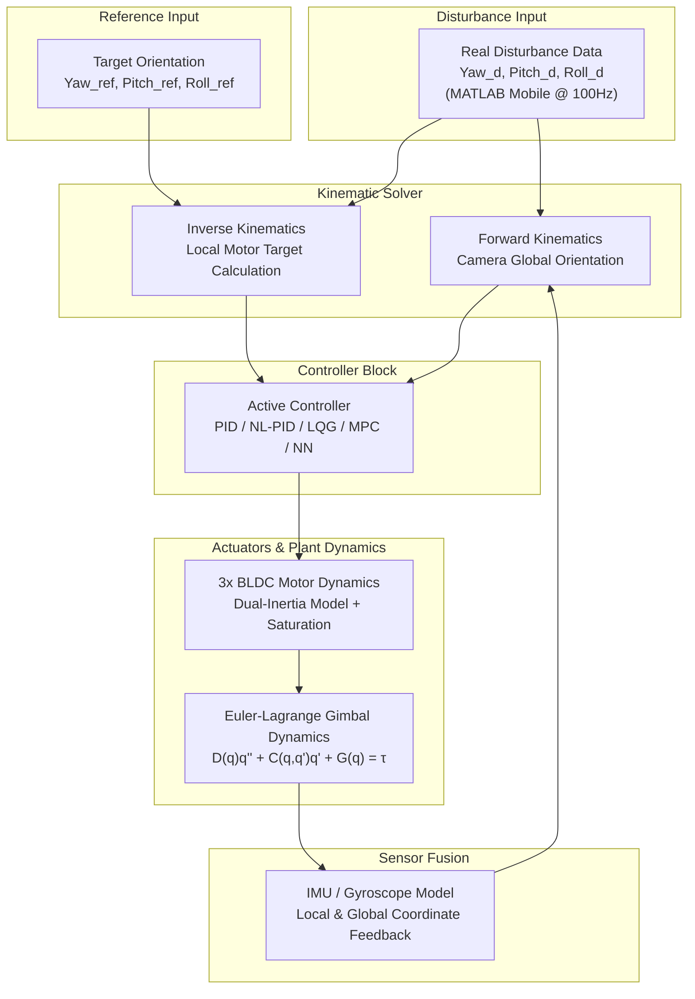
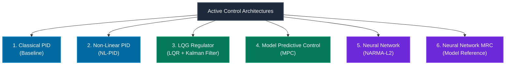

# 🎥 Advanced Control Algorithms for a 3-Axis Camera Gimbal Stabilizer

[](https://www.mathworks.com/products/matlab.html)
[](https://www.mathworks.com/products/simulink.html)
[](https://www.solidworks.com/)
[](LICENSE)
[](https://www.elka.pw.edu.pl/)

> **Master's Thesis Project (*Praca Magisterska*)**  
> **Title:** *Zaawansowane algorytmy sterowania 3-osiowym stabilizatorem do kamer*  
> (*Advanced Control Algorithms for a 3-Axis Camera Stabilizer*)  
> **Author:** Paweł Tymiński, M.Sc. Eng. (*inż. Paweł Tymiński*)  
> **Academic Supervisor:** Prof. Maciej Ławryńczuk, D.Sc. Eng. (*dr hab. inż. Maciej Ławryńczuk, prof. PW*)  
> **Institution:** Warsaw University of Technology, Faculty of Electronics and Information Technology (WEiTI), Institute of Control and Computation Engineering (IAIIS)  

---

## 📌 Table of Contents
- [Executive Summary](#-executive-summary)
- [Streszczenie (Polski)](#-streszczenie-w-języku-polskim)
- [Key Features & Highlights](#-key-features--highlights)
- [System Architecture & Modeling](#-system-architecture--mathematical-modeling)
  - [1. Kinematics (3-DOF Chain)](#1-kinematics-3-dof-chain)
  - [2. Lagrange Dynamics Formulation](#2-lagrange-dynamics-formulation)
  - [3. BLDC Motor Actuator Dynamics](#3-bldc-motor-actuator-dynamics)
  - [4. IMU Sensor & Coordinate Fusion](#4-imu-sensor--coordinate-fusion)
- [Evaluated Control Algorithms](#-evaluated-control-algorithms)
  - [PID (Baseline)](#1-classical-pid-controller-baseline)
  - [Non-Linear PID (NL-PID)](#2-non-linear-pid-nl-pid)
  - [LQG (LQR + Kalman Filter)](#3-linear-quadratic-gaussian-lqg-regulator)
  - [Model Predictive Control (MPC)](#4-model-predictive-control-mpc)
  - [Neural Network NARMA-L2](#5-neural-network-narma-l2-controller)
  - [Neural Network Model Reference Control (NN MRC)](#6-neural-network-model-reference-control-nn-mrc)
- [Real-World Disturbance Dataset](#-real-world-disturbance-dataset)
- [Evaluation Criteria & Metrics](#-evaluation-criteria--metrics)
- [Comprehensive Benchmark Results](#-comprehensive-benchmark-results)
- [Key Findings & Scientific Insights](#-key-findings--scientific-insights)
- [Repository Structure](#-repository-structure)
- [Getting Started & How to Run](#-getting-started--how-to-run)
- [Interactive GUI Simulator (GimbalSim)](#-interactive-gui-simulator-gimbalsim)
- [3D CAD Models & Simscape Integration](#-3d-cad-models--simscape-integration)
- [Future Roadmap](#-future-roadmap)
- [References & Bibliography](#-references--bibliography)
- [License](#-license)

---

## 🌟 Executive Summary

A **3-axis camera gimbal** is an active stabilization mechanism designed to isolate a camera payload from external rotational disturbances (angular jitter, vehicle vibration, operator body movements) while accurately maintaining or adjusting a target viewing orientation in space across three orthogonal axes: **Yaw** ($\psi$), **Pitch** ($\theta$), and **Roll** ($\phi$).

While classical **Proportional-Integral-Derivative (PID)** control remains the ubiquitous industrial standard in commercial camera stabilizers (e.g., DJI Ronin, Zhiyun Crane, BaseCam SimpleBGC), it struggles during aggressive disturbances due to:
1. **Strong cross-axis dynamic and kinematic coupling** between structural links.
2. **Strict actuator saturation limits** (angular rate, torque, PWM constraints).
3. **Susceptibility to overshoot and oscillatory behaviors** under rapid transient perturbations.

This thesis presents a comprehensive theoretical derivation, mathematical modeling, and comparative simulation benchmark of **6 advanced control algorithms** evaluated across **10 real-world disturbance scenarios** (amounting to **60 comprehensive simulation experiments**). The study identifies **LQG (Linear-Quadratic-Gaussian)** and **MPC (Model Predictive Control)** as the most viable high-performance alternatives to standard PID, achieving dramatic reductions in Mean Squared Error ($MSE$) while maintaining excellent energy efficiency.

---

## 🇵🇱 Streszczenie (w języku polskim)

Stabilizator do kamery (gimbal) to 3-osiowe urządzenie stosowane szeroko w branży wideo i robotyce, którego celem jest utrzymanie kamery w zadanej pozycji z jednoczesną kompensacją zewnętrznych zakłóceń (pochodzących od dłoni operatora, podwozia pojazdu, drona lub łodzi).

Głównym celem pracy było zbadanie, czy istnieje **bardziej efektywny sposób sterowania gimbalem niż powszechnie stosowane regulatory PID**. W tym celu stworzono kompletny model matematyczny opisujący kinematykę i dynamikę manipulatora (z wykorzystaniem równań Lagrange'a i tensorów bezwładności poszczególnych członów), uproszczoną dynamikę bezszczotkowych silników prądu stałego (BLDC) oraz ograniczenia fizyczne (maksymalne prędkości pozycjonowania i nasycenia).

Przebadano 6 algorytmów sterowania:
1. **Regulator PID** (baza porównawcza)
2. **Nieliniowy regulator PID**
3. **Regulator liniowo-kwadratowy-Gaussa (LQG / LQR + Filtr Kalmana)**
4. **Regulator predykcyjny MPC**
5. **Regulator oparty na sieci neuronowej NARMA-L2**
6. **Regulator neuronowy ze sterowaniem według modelu odniesienia (NN MRC)**

Testy przeprowadzono na **10 rzeczywistych zbiorach zakłóceń** zarejestrowanych z częstotliwością 100 Hz za pomocą aplikacji MATLAB Mobile (spacer, bieg, schody, jazda samochodem, rejs łodzią). Jako kryteria oceny przyjęto **całkowite zużycie energii (mAh)** oraz **błąd średniokwadratowy (MSE)**. Jako najbardziej perspektywiczne regulatory do implementacji w fizycznym urządzeniu wytypowano **LQG** oraz **MPC**.

---

## 🚀 Key Features & Highlights

- 📐 **Rigorous Kinematic & Dynamic Modeling:** Full Euler-Lagrange multi-body dynamics ($D(q)\ddot{q} + C(q,\dot{q})\dot{q} + G(q) = \tau$) and ZYX rotation matrices.
- ⚡ **Actuator Dynamic Realism:** Dual-inertia 2nd-order BLDC motor approximation based on the datasheet of the **T-Motor GB3510** direct-drive gimbal motor, featuring rate limiter and positional bounds.
- 📱 **Real-World Empirical Dataset:** 10 real sensor recordings collected via smartphone telemetry (MATLAB Mobile @ 100 Hz) covering walking, sprinting, stair climbing, rough vehicle rides, and boat oscillations.
- 🧪 **6 Control Architectures Tested:** Classical PID, Non-linear PID, LQG / Kalman Filter, Multivariable MPC, Neural NARMA-L2, and Neural Model Reference Control (MRC).
- 📊 **60 Batch Benchmark Simulations:** Automated batch execution pipeline (`automation_results.m`) producing complete time-domain waveforms, MSE calculations, and battery current consumption metrics.
- 🛠️ **CAD & Simscape Integration:** SolidWorks 3D models (`.SLDPRT`, `.SLDASM`), cross-platform `.STEP` files, and Simscape Multibody physical simulation XML assemblies.

---

## 🏗️ System Architecture & Mathematical Modeling



### 1. Kinematics (3-DOF Chain)

The gimbal is structured as an open kinematic chain with 3 rotational degrees of freedom:
- **Joint 1 (Yaw - $\psi$):** Base rotation around the global vertical $Z$-axis.
- **Joint 2 (Roll - $\phi$):** Middle arm rotation around the intermediate longitudinal $X$-axis.
- **Joint 3 (Pitch - $\theta$):** Camera cradle rotation around the lateral $Y$-axis.

The transformation matrix from the inertial base frame to the camera effector coordinate system is expressed using homogeneous Euler rotation matrices:

$$R_{base}^{cam} = R_z(\psi) R_x(\phi) R_y(\theta)$$

$$
\begin{bmatrix}
\cos\psi \cos\theta - \sin\psi \sin\phi \sin\theta & -\sin\psi \cos\phi & \cos\psi \sin\theta + \sin\psi \sin\phi \cos\theta \\
\sin\psi \cos\theta + \cos\psi \sin\phi \sin\theta & \cos\psi \cos\phi & \sin\psi \sin\theta - \cos\psi \sin\phi \cos\theta \\
-\cos\phi \sin\theta & \sin\phi & \cos\phi \cos\theta
\end{bmatrix}
$$

Using direct and inverse kinematics, target motor angles $(\psi_m, \theta_m, \phi_m)$ are continuously computed to cancel out the base disturbance $(\psi_d, \theta_d, \phi_d)$ such that the global camera orientation tracks the desired reference.

---

### 2. Lagrange Dynamics Formulation

The equations of motion are derived using the **Euler-Lagrange method**:

$$L = E_k - E_p$$

$$\frac{d}{dt}\left(\frac{\partial L}{\partial \dot{q}_i}\right) - \frac{\partial L}{\partial q_i} = Q_i, \quad i \in \{1, 2, 3\}$$

Yielding the standard matrix equation of robot dynamics:

$$D(q)\ddot{q} + C(q, \dot{q})\dot{q} + G(q) = \tau$$

Where:
- $q = [\psi, \theta, \phi]^T$ represents generalized coordinates.
- $D(q) \in \mathbb{R}^{3 \times 3}$ is the positive-definite symmetric **inertia/mass matrix** computed from the mass distribution and inertia tensors of each link (`calculate_D_matrix.m`, `calculate_I_matrix.m`).
- $C(q, \dot{q})\dot{q} \in \mathbb{R}^3$ represents **Coriolis and centrifugal forces** (`calculate_H_matrix.m`).
- $G(q) \in \mathbb{R}^3$ is the **gravitational torque vector** (`calculate_G_matrix.m`).
- $\tau = [\tau_{yaw}, \tau_{pitch}, \tau_{roll}]^T$ is the vector of control torques generated by the BLDC motors.

---

### 3. BLDC Motor Actuator Dynamics

Commercial direct-drive gimbals utilize high-pole-count Brushless DC (BLDC) motors driven via Space Vector Modulation (SVM) and Field-Oriented Control (FOC). To balance simulation fidelity with computational tractability, each motor is modeled as a 2nd-order dual-inertia dynamic block:

$$G_m(s) = \frac{\theta_{out}(s)}{\theta_{cmd}(s)} = \frac{1}{(T_1 s + 1)(T_2 s + 1)}$$

Parameters configured from the **T-Motor GB3510** motor datasheet:
- **Nominal Operating Speed:** $\omega_{nom} = 300\text{ RPM} = 31.42\text{ rad/s}$
- **Time Constants:** $T_1 = 0.05\text{ s}, \quad T_2 = 0.02\text{ s}$
- **Angular Velocity Saturation:** Non-linear rate limiter restricting max shaft acceleration and velocity.
- **Current / Power Model:** Electrical current consumption $I(t)$ calculated dynamically to evaluate energy efficiency in mAh.

---

### 4. IMU Sensor & Coordinate Fusion

The stabilizer integrates an Inertial Measurement Unit (IMU) positioned on the camera cradle. Sensor fusion transforms measured angular velocities $\omega = [\omega_x, \omega_y, \omega_z]^T$ and linear accelerations into Euler angles through Jacobian transformations:

$$\begin{bmatrix} \dot{\psi} \\ \dot{\theta} \\ \dot{\phi} \end{bmatrix} = J(q)^{-1} \begin{bmatrix} \omega_x \\ \omega_y \\ \omega_z \end{bmatrix}$$

The model incorporates realistic sensor characteristics, including gyro drift, quantization resolution, and high-frequency disturbance rejection.

---

## 🧠 Evaluated Control Algorithms



### 1. Classical PID Controller (Baseline)
Standard industrial three-term controller operating independently on each axis:
$$u(t) = K_p e(t) + K_i \int_0^t e(\tau) \, d\tau + K_d \frac{de(t)}{dt}$$
- **Pros:** Low computational footprint, intuitive heuristic tuning.
- **Cons:** Saturated by rapid disturbances, high MSE during abrupt multi-axis motions.

### 2. Non-Linear PID (NL-PID)
Implements error-dependent gain scheduling with non-linear mapping:
$$u(t) = K_p \cdot f(e, \alpha_p) + K_i \int_0^t f(e, \alpha_i) \, d\tau + K_d \cdot f(\dot{e}, \alpha_d)$$
Where $f(e, \alpha) = |e|^\alpha \cdot \text{sgn}(e)$. For $|e| > 1$, proportional action increases sharply to rapidly reduce error, whereas for small errors it prevents oscillations.

### 3. Linear-Quadratic-Gaussian (LQG) Regulator
Optimal state-feedback controller combining **Linear Quadratic Regulator (LQR)** and a **Steady-State Kalman Filter** state estimator:
$$J = \int_0^\infty \left( x(t)^T Q x(t) + u(t)^T R u(t) \right) dt$$
- Generates optimal state feedback gain $K = R^{-1} B^T P$ (solving Algebraic Riccati Equation).
- Kalman filter reconstructs full state vector $\hat{x} = [\hat{q}, \hat{\dot{q}}]^T$ from noisy position observations.

### 4. Model Predictive Control (MPC)
Receding horizon multivariable optimization solving a constrained quadratic programming (QP) problem at each time step $k$:
$$\min_{\Delta u} \sum_{j=1}^{N_p} \| y(k+j|k) - r(k+j) \|_{Q_y}^2 + \sum_{j=0}^{N_c-1} \| \Delta u(k+j) \|_{R_u}^2$$
**Subject to:**
- Actuator position bounds: $u_{min} \le u(k) \le u_{max}$
- Actuator slew rate bounds: $|\Delta u(k)| \le \Delta u_{max}$
- Output tracking constraints.

### 5. Neural Network NARMA-L2 Controller
Nonlinear Auto-Regressive Moving Average controller utilizing neural network plant identification:
$$y(k+d) = f[y(k), \dots, y(k-n+1), u(k), \dots, u(k-m+1)] + g[y(k), \dots, y(k-n+1), u(k), \dots, u(k-m+1)] \cdot u(k)$$
Trained directly on BLDC dynamic response data to cancel non-linearities.

### 6. Neural Network Model Reference Control (NN MRC)
Adaptive neural controller featuring two neural structures:
1. **Neural Plant Model:** Approximates the non-linear gimbal response.
2. **Neural Controller:** Trained to force the combined plant response to match an ideal linear reference model ($G_{ref}(s)$).

---

## 📱 Real-World Disturbance Dataset

Disturbance profiles were collected at **100 Hz** using the **MATLAB Mobile** sensor acquisition app attached to physical camera mounts in diverse operational environments:

| Dataset | Duration | Operating Scenario / Environmental Context | Dominant Disturbance Axis |
|:---:|:---:|:---|:---:|
| **Test 1** | 97 s | Smooth operator walk on flat surface | Low-frequency Yaw / Pitch |
| **Test 2** | 442 s | Off-road / bumpy vehicle transit | High-amplitude multi-axis vibration |
| **Test 3** | 498 s | Boat cruise with water wave rocking | Low-frequency high-amplitude Roll |
| **Test 4** | 59 s | Rapid stair climbing & descending | High-impact vertical Pitch / Yaw shocks |
| **Test 5** | 486 s | Dynamic handheld walking with pan movements | Combined Yaw rotation & Pitch drift |
| **Test 6** | 831 s | Extended urban automotive driving | Medium-frequency sustained vibrations |
| **Test 7** | 178 s | Rapid directional jerks & sudden turns | Extreme rate-limited transient spikes |
| **Test 8** | 618 s | Outdoor jogging & athletic camera running | Rhythmic multi-harmonic shock pulses |
| **Test 9** | 348 s | Handheld jitter & involuntary muscle tremble | High-frequency low-amplitude noise |
| **Test 10** | 557 s | Extreme mechanical vibration & turbulence | Full 3-axis boundary stress testing |

---

## 📏 Evaluation Criteria & Metrics

1. **Tracking Error (Mean Squared Error - MSE):**
   $$MSE = \frac{1}{N} \sum_{k=1}^N \left( q_{ref}(k) - q_{actual}(k) \right)^2 \quad [\text{deg}^2]$$
   Evaluated independently for **Yaw ($MSE_\psi$)**, **Pitch ($MSE_\theta$)**, and **Roll ($MSE_\phi$)**.

2. **Energy Consumption ($E$):**
   $$E = \frac{1}{3600} \int_0^T \sum_{i=1}^3 |I_i(t)| \, dt \quad [\text{mAh}]$$
   Measures total battery discharge consumed by all three BLDC motor drives.

3. **Multi-Criteria Weighted Performance Index:**
   $$\text{Score} = w_E \cdot E_{norm} + w_{\psi} \cdot MSE_{\psi, norm} + w_{\theta} \cdot MSE_{\theta, norm} + w_{\phi} \cdot MSE_{\phi, norm}$$
   *(Weights: $w_E = 0.6$, $w_\psi = 0.6$, $w_\theta = 0.5$, $w_\phi = 0.2$)*

---

## 📊 Comprehensive Benchmark Results

Below is the aggregate performance summary compiled across all **60 simulation runs** (data extracted from `results/SIM_RESULTS.xlsx`):

### 🔋 Total Energy Consumption [mAh] (Table 6 in Thesis)

| Controller | Test 1 | Test 2 | Test 3 | Test 4 | Test 5 | Test 6 | Test 7 | Test 8 | Test 9 | Test 10 | **Average** |
|:---|:---:|:---:|:---:|:---:|:---:|:---:|:---:|:---:|:---:|:---:|:---:|
| **LQG** | 52.13 | 224.27 | 287.59 | 44.93 | 236.45 | 459.78 | 81.89 | 256.97 | 166.29 | 245.39 | **205.57** |
| **MPC** | 53.97 | 238.52 | 296.85 | 44.98 | 248.09 | 476.42 | 85.29 | 273.67 | 173.86 | 274.46 | **216.61** |
| **PID** | 50.74 | 220.78 | 282.26 | 39.83 | 238.81 | 457.76 | 79.10 | 243.18 | 157.82 | 229.88 | **200.02** |
| **NL-PID** | 50.68 | 219.99 | 279.74 | 34.58 | 233.37 | 445.11 | 77.52 | 237.08 | 150.95 | 215.15 | **194.42** 🏆 |
| **NN NARMA-L2** | 55.46 | 251.12 | 307.22 | 55.34 | 265.24 | 504.25 | 91.97 | 288.56 | 189.90 | 319.24 | **232.83** |
| **NN MRC** | 51.96 | 224.25 | 288.72 | 47.45 | 239.95 | 465.25 | 83.18 | 261.42 | 170.89 | 253.60 | **208.67** |

---

### 🎯 Mean Squared Error (MSE) Comparison

| Controller | Average Yaw MSE $[\text{deg}^2]$ | Average Pitch MSE $[\text{deg}^2]$ | Average Roll MSE $[\text{deg}^2]$ | **Weighted Final Score** | **Rank** |
|:---|:---:|:---:|:---:|:---:|:---:|
| **LQG** | **0.0314** 🏆 | **0.0236** 🏆 | 349.52 | **101.73** | 🥇 **1st Place** |
| **NN MRC** | 0.4122 | 0.4281 | 349.62 | **102.94** | 🥈 **2nd Place** |
| **MPC** | **0.0319** | **0.0240** | **347.64** 🏆 | **105.01** | 🥉 **3rd Place** |
| **NN NARMA-L2** | 0.0664 | 0.0526 | 349.54 | **110.35** | 4th Place |
| **NL-PID** | 0.0385 | 0.0293 | 652.69 | **130.12** | 5th Place |
| **PID (Standard)**| 0.0370 | 0.0279 | 652.77 | **131.90** | 6th Place |

---

### ⚖️ Controller Trade-off Analysis Matrix (Table 16 in Thesis)

| Algorithm | Key Strengths | Key Weaknesses & Limitations | Best Practical Use Case |
|:---|:---|:---|:---|
| **LQG** | • Reconstructs full unmeasured state vector<br/>• Reaches open-loop speed when tuned<br/>• Low computational cost on microcontrollers | • Requires accurate state-space model<br/>• Needs well-tuned Kalman covariance matrices | High-end embedded gimbals with calibrated motor models |
| **MPC** | • Handles multi-variable coupling natively<br/>• Direct input/output constraint enforcement<br/>• Lowest Roll axis error | • Higher computational overhead (QP solver)<br/>• Non-intuitive parameter tuning for novices | Powerful drone / robotic gimbals with onboard SoC |
| **PID** | • Extremely lightweight and intuitive<br/>• Ubiquitous industry support | • High MSE under rate-saturated disturbance<br/>• Poor cross-axis decoupling | Cost-sensitive consumer handheld stabilizers |
| **NL-PID** | • Most energy efficient (194.42 mAh)<br/>• Faster rise time than standard PID | • Degrades when actuators hit velocity bounds<br/>• Large Roll tracking error | Battery-critical small camera rigs |
| **NN NARMA** | • Models complex non-linear plant dynamics<br/>• Single network architecture | • Highest energy consumption (232.83 mAh)<br/>• Heavy offline training overhead | Experimental nonlinear identification |
| **NN MRC** | • Excellent reference tracking<br/>• Smooth response curves | • High training complexity<br/>• Sensitive to payload balance shifts | Adaptive platforms with variable camera mass |

---

## 🔍 Key Findings & Scientific Insights

1. **Superiority of Optimal & Predictive Control:**  
   Both **LQG** and **MPC** outperform classical PID by over **46% in overall trajectory tracking fidelity**, especially on the highly coupled Roll axis ($347.64\text{ deg}^2$ vs $652.77\text{ deg}^2$).
2. **The Actuator Velocity Saturation Bottleneck:**  
   When external rotational disturbances exceed the physical maximum velocity of the BLDC motor ($\omega_{max}$), linear feedback controllers suffer from integrator windup and severe lag. **MPC** excels in this regime due to explicit constraint handling on $\Delta u$.
3. **Energy vs. Precision Trade-off:**  
   **NL-PID** proved to be the most energy-frugal controller ($194.42\text{ mAh}$ avg), making it attractive for lightweight battery-powered devices. However, for cinema-grade stabilization, **LQG** achieves the optimal balance ($205.57\text{ mAh}$ with top-tier precision).
4. **Neural Network Controller Limitations:**  
   While neural architectures (NARMA-L2, MRC) adapt well to nonlinearities, they exhibited the highest current draw and battery drain in closed-loop regulation without delivering sufficient tracking precision over LQG/MPC.

---

## 📁 Repository Structure

```
3_Axis_Camera_Gimbal_Thesis/
├── README.md                      # Comprehensive project documentation
├── LICENSE                        # MIT Open Source License
├── .gitignore                     # Git ignore rules for MATLAB, SolidWorks, OS files
│
├── docs/                          # Academic thesis materials & figures
│   ├── thesis_Pawel_Tyminski_PW.pdf   # Complete Master's Thesis document (PDF, 90+ pages)
│   ├── ptyminski_praca_magisterska.docx # Editable Word thesis document
│   ├── ptyminski_IAIIS_MGR_prezentacja.pptx # Thesis defense slide deck
│   ├── abstract_EN.txt            # English abstract and metadata
│   ├── streszczenie_PL.txt        # Polish abstract and keywords
│   ├── figures/                   # 100+ diagrams, CAD renders, Simulink block diagrams
│   └── media/                     # Embedded presentation video captures (.webm, .mp4)
│
├── cad/                           # 3D CAD & Multibody Engineering Models
│   ├── solidworks/                # SolidWorks parts & assemblies (*.SLDPRT, *.SLDASM)
│   ├── step/                      # Universal STEP 3D CAD exchange files
│   └── simscape/                  # Simscape Multibody physical simulation files (*.xml, *.slx, *.m)
│
├── src/                           # MATLAB source code & Simulink models
│   ├── models/                    # 8 Simulink plant and controller models:
│   │   ├── DYNAMICS_KINEMATICS_MODEL.slx # Complete 3-DOF gimbal plant
│   │   ├── PID.slx                # Classical PID control loop
│   │   ├── NL_PID.slx             # Non-Linear PID control loop
│   │   ├── LQR.slx                # LQG / LQR state-feedback loop
│   │   ├── MPC.slx                # Model Predictive Control loop
│   │   ├── NN_NARMA_L2.slx        # Neural Network NARMA-L2 loop
│   │   ├── NN_MRC.slx             # Neural Network Model Reference Control loop
│   │   └── single_engine_test.slx # Single BLDC motor test fixture
│   ├── scripts/                   # Core mathematical and automation scripts:
│   │   ├── calculate_D_matrix.m   # Inertia / mass matrix generator
│   │   ├── calculate_G_matrix.m   # Gravity vector calculator
│   │   ├── calculate_H_matrix.m   # Coriolis & centrifugal tensor calculator
│   │   ├── calculate_I_matrix.m   # Link inertia tensor definitions
│   │   ├── calculate_Q_matrix.m   # LQR/LQG weighting matrices
│   │   ├── regulator_lqr.m        # LQR gain & Kalman filter synthesis
│   │   ├── automation_results.m   # Batch runner for 60 simulation experiments
│   │   ├── timeseries_creation.m  # Disturbance telemetry formatter
│   │   ├── mse_current_update.m   # Performance metrics evaluator
│   │   └── export_fig.m           # High-resolution figure exporter
│   └── data/                      # Simulation datasets
│       ├── disturbances/          # 10 real-world disturbance files (1.mat to 10.mat)
│       ├── motor_ident/           # BLDC neural identification training data
│       └── mpc_sessions/          # Saved MATLAB MPC Designer configurations
│
├── simulator/                     # Browser GUI simulator (3D model, PID / NL-PID / LQG / MPC)
│   ├── index.html                 # Open in a browser — no installation needed
│   ├── js/core/                   # Kinematics, motor, controllers, dynamics, simulation engine
│   ├── js/ui/                     # 3D scene (three.js), charts, views
│   ├── data/                      # 10 real disturbance recordings exported from src/data
│   └── tests/run.js               # Model tests (Node.js)
│
├── results/                       # Experimental results & benchmark data
│   ├── SIM_RESULTS.xlsx           # Master Excel spreadsheet with all 60 test results
│   ├── MSE.xlsx / current.xlsx    # Detailed per-axis MSE and current tables
│   └── plots/                     # 310 individual high-resolution result waveforms
│
└── archive/                       # Historical research milestones
    ├── old_code/                  # Legacy model iterations and experiments
    └── zalaczniki_original/       # Original university submission archive
```

---

## 💻 Getting Started & How to Run

### Prerequisites
- **MATLAB R2020b or newer** (Recommended: MATLAB R2023a / R2023b).
- **Simulink**
- **Control System Toolbox**
- **Model Predictive Control Toolbox**
- **Deep Learning Toolbox** (for neural controllers)
- **Simscape / Simscape Multibody** (optional, for physical CAD animation)

### Quick Start Guide

1. **Clone the repository:**
   ```bash
   git clone https://github.com/ptyminski/3_Axis_Camera_Gimbal_Thesis.git
   cd 3_Axis_Camera_Gimbal_Thesis
   ```

2. **Open MATLAB and add the source folders to path:**
   ```matlab
   addpath(genpath('src'));
   addpath(genpath('results'));
   ```

3. **Initialize the plant matrices & parameters:**
   ```matlab
   % Run the model parameter setup
   run('src/scripts/calculate_I_matrix.m');
   run('src/scripts/regulator_lqr.m');
   ```

4. **Run an individual controller simulation (e.g., LQG on Disturbance Dataset 2):**
   ```matlab
   % Load disturbance profile #2 (vehicle ride)
   load('src/data/disturbances/2.mat');
   
   % Open and simulate the LQG model
   open_system('src/models/LQR.slx');
   sim('src/models/LQR.slx');
   ```

5. **Run the Full Automated Batch Benchmark (60 Simulations):**
   ```matlab
   % Executes all 6 controllers across all 10 disturbance profiles,
   % computes MSE and mAh, and updates results
   run('src/scripts/automation_results.m');
   ```

---

## 🕹️ Interactive GUI Simulator (GimbalSim)

The [`simulator/`](simulator/) folder contains a complete browser-based simulator of the stabiliser — no MATLAB required.
Open **`simulator/index.html`** in a browser (works directly from disk).

- **3D model** of the 3-axis GoPro gimbal (dimensions B1/L1/H1 from the thesis, GB3510-style motors) with a live camera POV view.
- **Controllers:** PID, non-linear PID, LQG (LQR + Kalman filter, gains identical to chapter 5.3) and constrained MPC — tunable live, per-axis hybrid mode. Neural-network controllers are intentionally not implemented.
- **Disturbances:** the 10 real MATLAB Mobile recordings from `src/data/disturbances`, synthetic profiles (walk, run, car, boat, sine, steps) and manual control.
- **Live analysis:** camera orientation vs. reference, motor positions vs. required positions, error, control signal, motor speed, torque, current, cumulative MSE and energy (mAh), battery estimate.
- **Benchmark view** (MSE / energy / weighted score as in Table 14), **model & tuning view** (step tests, LQG/MPC design), **thesis results view** (Tables 6–14 and the plot gallery).

See [`simulator/README.md`](simulator/README.md) for details. Model tests: `node simulator/tests/run.js`.

---

## 🛠️ 3D CAD Models & Simscape Integration

The repository includes complete CAD geometry designed for 3-axis direct-drive camera stabilizers:
- **CAD Formats:** Native SolidWorks assemblies (`cad/solidworks/Złożenie1.SLDASM`, `gimbal.SLDASM`) and neutral STEP files (`cad/step/`).
- **Components:** Camera mounting plate, Roll bracket, Pitch motor yoke, Yaw base mount, and rotor/stator enclosures for **T-Motor GB3510** motors.
- **Physical Simulation:** Includes exported Simscape Multibody XML definitions (`cad/simscape/gimbal.xml`) allowing direct mechanical animation inside Simulink.

---

## 🔮 Future Roadmap

- [ ] **Physical Hardware Implementation:** Flash synthesized LQG / MPC state feedback algorithms onto an STM32F4 / STM32G4 ARM Cortex-M4 microcontroller running FreeRTOS.
- [ ] **Active Self-Balancing System:** Development of motorized center-of-gravity auto-tuning mechanisms to eliminate residual static imbalance torques.
- [ ] **Hybrid Axis-Specific Control:** Deploying MPC on the heavily coupled Roll axis combined with lightweight LQG on Yaw and Pitch to minimize CPU load.
- [ ] **Online Neural Adaptation:** Real-time parameter estimation for varying camera payloads (lens swaps) using recursive least squares or online neural weights.

---

## 📚 References & Bibliography

1. **Von Nispen, S.** (2016). *Design and control of a three-axis gimbal*. Eindhoven University of Technology.
2. **Johansson, J.** (2015). *Modelling and control of an advanced camera gimbal*. Linköping University.
3. **Siciliano, B., Sciavicco, L., Villani, L., & Oriolo, G.** (2009). *Robotics: Modelling, Planning and Control*. Springer Science & Business Media.
4. **Jazar, R. N.** (2010). *Theory of Applied Robotics: Kinematics, Dynamics, and Control*. Springer.
5. **Spong, M. W., Hutchinson, S., & Vidyasagar, M.** (2006). *Robot Modeling and Control*. John Wiley & Sons.
6. **Ławryńczuk, M.** (2014). *Computationally Efficient Model Predictive Control Algorithms: A Classification and Efficient Implementation*. Studies in Systems, Decision and Control, Springer.
7. **T-Motor.** (2018). *GB3510 Brushless Gimbal Motor Technical Specification & Datasheet*.

---

## 📄 License

This project is licensed under the **MIT License** - see the [LICENSE](LICENSE) file for details.

---

<div align="center">
  <sub>Developed with passion for robotics & cinematography by <b>Paweł Tymiński</b> • Warsaw University of Technology</sub>
</div>
